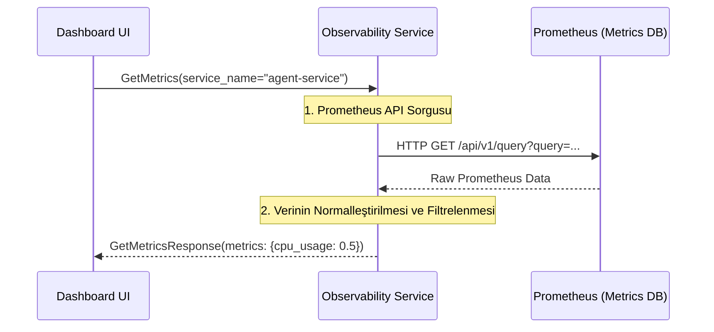

# 📊 Sentiric Observability Service - Mantık ve Akış Mimarisi

**Stratejik Rol:** Platformdaki tüm loglama, metrik ve izleme (tracing) verilerine erişim için tek bir gRPC arayüzü sunar. Bu, Dashboard UI gibi yönetim araçlarının Prometheus ve Loki gibi harici sistemlerle doğrudan konuşmasını engeller ve API standardizasyonu sağlar.

---

## 1. Temel Akış: Metrik Çekme (GetMetrics)

## 2. Abstraction Katmanı
Bu servis, harici gözlemlenebilirlik araçlarının (Prometheus, Loki, Jaeger) URL'lerini ve sorgu dillerini (PromQL, LogQL) gizler. İstemci, sadece hizmet adını ve metrik/log türünü belirtir.
