# 📊 Sentiric Observability Service - Mantık ve Akış Mimarisi

**Stratejik Rol:** Platformdaki tüm loglama, metrik ve izleme (tracing) verilerine erişim için tek bir gRPC arayüzü sunar. Bu, Dashboard UI gibi yönetim araçlarının Prometheus ve Loki gibi harici sistemlerle doğrudan konuşmasını engeller ve API standardizasyonu sağlar.

---

## 1. Temel Akış: Metrik Çekme (GetMetrics)

```mermaid
sequenceDiagram
    participant Dashboard as Dashboard UI
    participant OBS as Observability Service
    participant Prometheus as Prometheus (Metrics DB)
    
    Dashboard->>OBS: GetMetrics(service_name="agent-service")
    
    Note over OBS: 1. Prometheus API Sorgusu
    OBS->>Prometheus: HTTP GET /api/v1/query?query=...
    Prometheus-->>OBS: Raw Prometheus Data
    
    Note over OBS: 2. Verinin Normalleştirilmesi ve Filtrelenmesi
    OBS-->>Dashboard: GetMetricsResponse(metrics: {cpu_usage: 0.5})
```

## 2. Abstraction Katmanı
Bu servis, harici gözlemlenebilirlik araçlarının (Prometheus, Loki, Jaeger) URL'lerini ve sorgu dillerini (PromQL, LogQL) gizler. İstemci, sadece hizmet adını ve metrik/log türünü belirtir.
